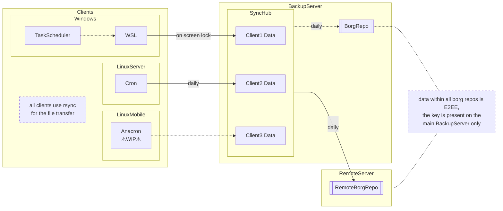

# Backup

This project contains all the code and documentation of my backup solution for future reference.

- Clients use [rsync](https://rsync.samba.org/) to push their data into a _sync hub_. Each client can only access their own directory within the sync hub
  - rsync only transfers file diffs
- These files get used to create backups with [Borg](https://borgbackup.readthedocs.io/en/stable/) that are not acessible by the clients
  - Borg backups are deduplicated and compressed
- One backup of the sync hub is on each the local and remote backup server
- Note that the borg-backups are encrypted, so the data stays protected and the remote-server can't access it

# Process
- clients push their data to the live-dir
- backup server creates the local- and remote borg-backup afterwards

# Retention Policy
Keep the following backups: (might be expanded when disk usage is assessable)
- 7 daily
- 4 weekly
- 6 monthly (->12)

# Security
There are 3 main components to this strategy:
### Client
- trusts Backup Server with confidentiality and availability
  - can only write to own *sync dir* through forced ssh command -> no danger to other clients backups
  - can only modify *sync dir* and not the backups in borg repositories -> safe from malicious deletion of backups
  - data is not pulled by the backup server, so no access has to be granted on the clients
### Backup Server
- clients need to keep the data inside the sync hub up-to-date
  - clients have forced ssh commands -> only rsync access to their sync dir

- trusts remote server with availability of the data
  - the data inside the borg repo is encrypted, confidentiality and integrity is ensured
  - only the availability is based on trust, enables the use of external hosting providers

### Remote Backup Server
- main backup server has forced ssh command to only allow using borg for the specified repo

# Clients

### Linux Server
- schedule execution of [client backup script](clients/linux/linux_client_backup.sh) and adjust files, excludes

### [Windows](clients/windows/readme.md)

# Remote Backup Server
- start is scheduled from 03:30am onwards
- no rate-limiting required
